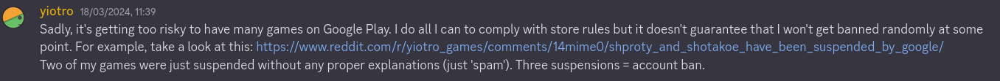

# Bubble bounce

A simple 2-player game designed primarily for mobile use.

Originally it was written in pure JS, now it is rewritten in TypeScript.

> [!NOTE]
> The game is really choppy on firefox for android. If on android use a
> chromium-based browser instead.

## Game options

- You can configure the looks of your bubbles or randomize them, this doesn't
  change anything gameplay wise.
- **Small bubbles**: The game always starts you off with 1 big bubble and 4
  medium-size bubbles, this option configures the amount of small bubbles that
  spawn
- **Required bounce**: You have to first bounce off of a wall or your own
  bubble. This makes the game a bit more skill-based because you have to think
  about the reflection of the bounces.
- **Blocks**: Toggle the barriers in the middle (the ones on the side stay
  either way)

## Notes

- You can **scroll/pinch** to zoom in and out the board. This is useful for
  making fully charged shots in some situations.
- To **cancel the current shot** let go inside the bubble you are aiming.
- When the bubbles are taking too long to stop moving, the **game speeds up**.
  This does not alter the physics in any way so what happens would have happened
  either way.

## Inspiration

The concept is based on one of the mini-games in the game called **Shmatoosto**
by [**Yiotro**](https://yiotro.com/about/). Sadly, it's been unpublished since
due to increasing demands from google on the play store.

